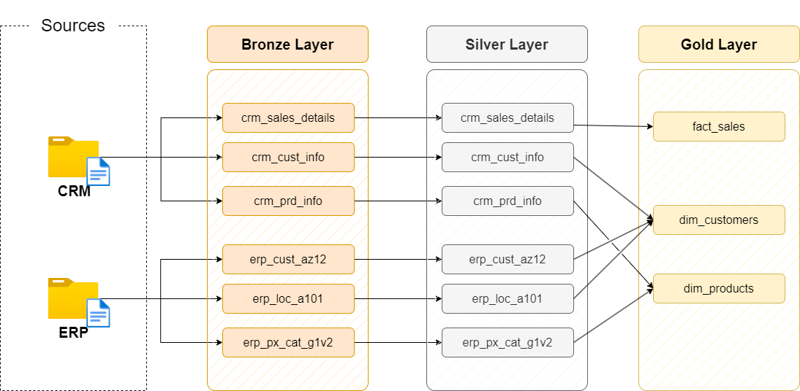
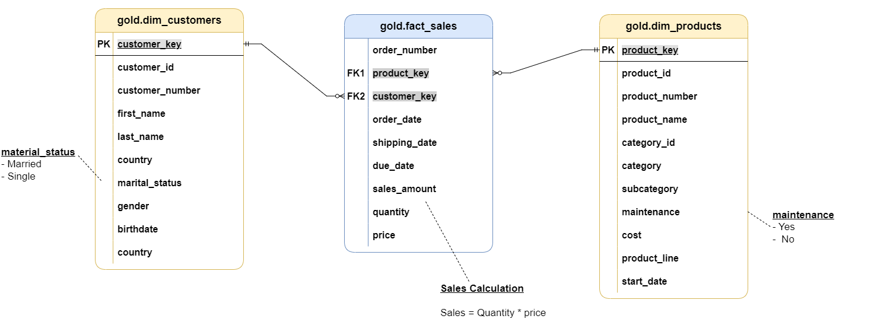
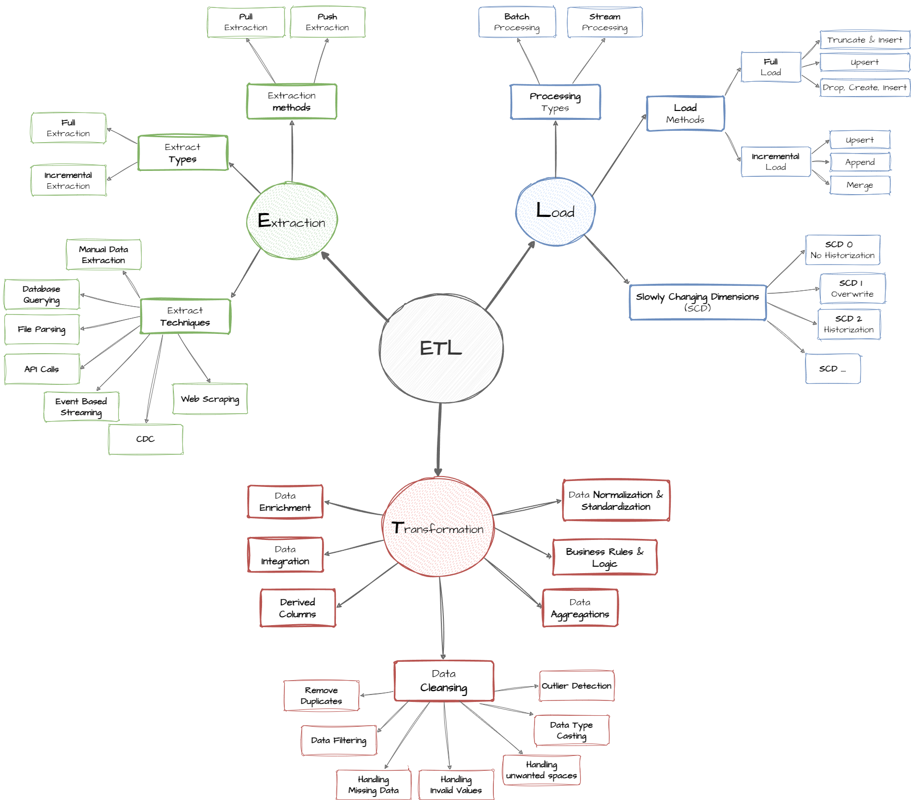

# Enterprise Data Warehouse Project

## Overview
This repository hosts the data engineering logic, documentation, and schema definitions for the Enterprise Data Warehouse (DWH). The project follows a **Medallion Architecture** (Bronze, Silver, Gold layers) to transform raw data from CRM and ERP systems into business-ready analytical assets.

## High-Level Architecture
The architecture is designed to handle data ingestion from multiple sources, processing it through three distinct layers before consumption by BI tools and SQL queries.

### Layers Overview
* **Bronze Layer (Raw):** Stores data in its original format from source systems (CSV, Databases). No transformations are applied; tables are loaded via full load or truncate & insert.
* **Silver Layer (Cleaned):** Data is deduplicated, cleansed, and standardized. Enforces data types and handles missing values.
* **Gold Layer (Business):** Modeled using a Star Schema (Fact and Dimensions). This layer applies business logic, aggregations, and data integration for reporting.

---

## Data Flow & Lineage
Data is ingested from two primary source systems: **CRM** (Customer Relationship Management) and **ERP** (Enterprise Resource Planning).

### Integration Logic
The data integration process joins related entities across systems. For example, customer information is derived from both `crm_cust_info` and `erp_cust_az12` to create a unified view in the Gold layer.

---

## Data Model (Gold Layer)
The Gold Layer is structured as a **Star Schema** to optimize analytical query performance. It consists of a central fact table surrounding dimension tables.

### Schema Details

#### 1. Fact Table: `gold.fact_sales`
Stores transactional sales data.
* **Key Metrics:** `sales_amount`, `quantity`, `price`.
* **Foreign Keys:** `product_key`, `customer_key`.
* **Grain:** One row per sales order line item.

#### 2. Dimension: `gold.dim_customers`
Stores enriched customer details including demographics and location.
* **Attributes:** Name, Country, Marital Status, Gender, Birthdate.
* **Key:** `customer_key` (Surrogate).

#### 3. Dimension: `gold.dim_products`
Stores product attributes, categorization, and costs.
* **Attributes:** Product Name, Category, Subcategory, Cost, Product Line.
* **Key:** `product_key` (Surrogate).

---

## ETL Methodology
The ETL (Extract, Transform, Load) pipeline utilizes various extraction methods and processing types depending on the data velocity and volume.

* **Extraction:** Supports Database Querying and File Parsing.
* **Transformation:** Includes Data Cleaning, Normalization, and creating Derived Columns (e.g., `Sales = Quantity * Price`).
* **Loading:** Supports Full Load and Incremental Load strategies using stored procedures.

---

## Naming Conventions
To maintain consistency, the following naming conventions are enforced across the data warehouse.

### General Principles
* **Case:** `snake_case` (lowercase with underscores).
* **Language:** English only.
* **Restrictions:** No SQL reserved words.

### Table Naming
| Layer | Pattern | Example |
| :--- | :--- | :--- |
| **Bronze** | `<sourcesystem>_<entity>` | `crm_customer_info` |
| **Silver** | `<sourcesystem>_<entity>` | `crm_customer_info` |
| **Gold** | `<category>_<entity>` | `dim_customers`, `fact_sales` |

### Column Naming
* **Surrogate Keys:** Must end with `_key` (e.g., `customer_key`).
* **Technical Columns:** Must start with `dwh_` (e.g., `dwh_load_date`).

### Stored Procedures
Loading procedures must follow the pattern `load_<layer>` (e.g., `load_bronze`, `load_silver`).